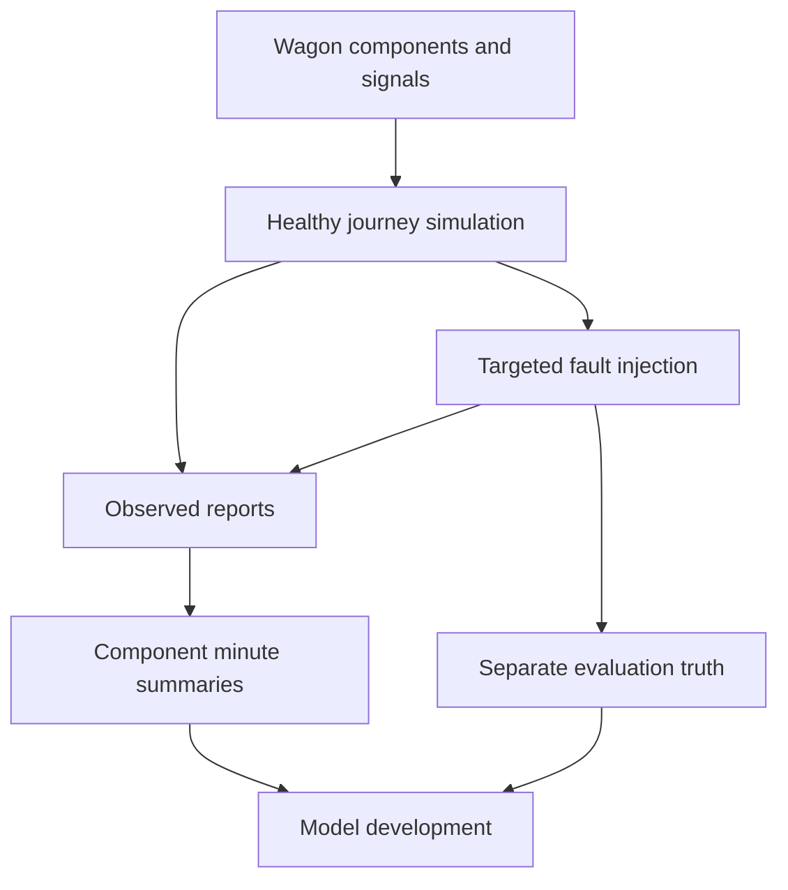

# FleetGuard AI — Documentation guide

Understand the system, reproduce the data, then inspect the summaries.

| Question | Read |
| --- | --- |
| What are we building, and what decisions may it support? | [Product contract](product_contract.md) |
| How does one wagon fit together? | [Domain specification](domain_specification.md) and the [interactive atlas](../atlas/index.html) |
| Which component produces each signal? | [Signal catalogue](signal_catalogue.md) |
| What do the terms and abbreviations mean? | [Glossary](glossary.md) |
| What must a valid record contain? | [Data contract](data_contract.md) and [JSON Schemas](contracts/README.md) |
| How do healthy journeys and faults become data? | [Generation guide](dataset_generation_guide.md) and [anomaly catalogue](anomaly_catalogue.md) |
| How are wagons assigned to datasets? | [Portfolio dataset design](portfolio_dataset.md) |
| How are readings summarised for modelling? | [Hierarchical feature rules](hierarchical_feature_rules.md) |
| Where do the simulated locations come from? | [Route data](route_data.md) |

## The connected story

Wagon components provide measurements. The controller assembles one reporting
snapshot. The simulator reproduces that structure using a planned journey,
asset characteristics and repeatable variation. A selected fault transforms a
healthy baseline. Separate truth describes the injected scenario.

The portfolio layer assigns wagons to train, validation and test before feature
creation. Every completed minute is then summarised separately for the wagon,
each bogie, each axle and each wheel. Original readings remain available.
Model selection, training, serving, monitoring and deployment follow this foundation.

## Current implementation

- Generator package: 0.3.0; source contracts: 3.2; portfolio plan: 1.0.
- Feature contracts: 2.0; separate 60-second component summaries.
- Twelve anomaly types; thirteen fault variants because controller failure has
  persistent and bounded modes.
- Standard sampling: 10 seconds; supported alternatives: 1 and 60 seconds.
- Generator, portfolio validation and hierarchical feature generation are implemented.
- Model development and the operational ML platform are subsequent work; no
  trained-model effectiveness or commercial deployment is claimed here.

## Reading and maintenance

Start with the atlas and this index, then use the catalogues as reference and the
generation guide as the runnable workflow. Historical `session_*.md` files record
implementation sessions; they are not the primary operating instructions.

The Python contracts and implementations are authoritative. When behaviour
changes, update the contract, signal/anomaly catalogues, feature policies and
commands together. The JSON Schemas in this pack are snapshots of those contracts,
not a replacement for Python cross-field validation.
