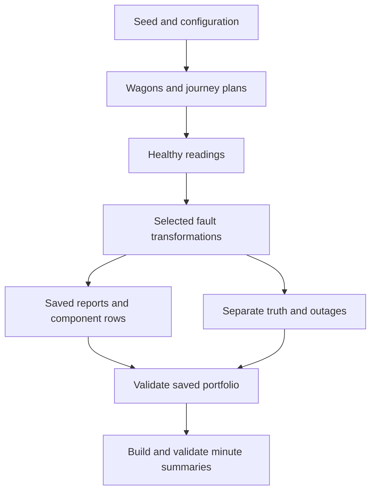

# FleetGuard AI — Dataset generation and validation guide

This is the primary repeatable workflow for generator 0.3.0, source schema 3.2,
portfolio plan 1.0 and feature schema 2.0. Commands use **Windows CMD** from the
repository root. Read the [signal catalogue](signal_catalogue.md),
[anomaly catalogue](anomaly_catalogue.md) and [feature rules](hierarchical_feature_rules.md)
for the behaviour behind the commands.

## 1. What the workflow creates

| Layer | What it does | What it does not establish |
| --- | --- | --- |
| Healthy simulation | Wagon properties, journey plan, motion, pressures, temperatures and power | Calibrated physical railway dynamics |
| Anomaly injection | Targeted changes to a healthy baseline; some outages suppress reports | Real failure diagnosis or safety decisions |
| Portfolio planner | Assigns unique wagons to train/validation/test and fault/control duties | Natural fault prevalence or exhaustive target/severity balance |
| Saved-file validation | Checks contracts, identities, counts, hashes and cross-file consistency | Real-world model effectiveness |
| Hierarchical features | Adds separate one-minute summaries at four component levels | A trained model or mandatory modelling resolution |



Each portfolio wagon has its own seeded duty, but routes can repeat. Generation
uses synthetic London–Avonmouth, Avonmouth–Cardiff, Cardiff–Swansea and
London–Swansea corridors, including reverse travel. Journey duration follows
planned running and dwell rather than a fixed one-hour run. Coordinates are
coarse interpolations; terminal operations are fictional.

## 2. Prepare and verify the environment

```cmd
cd /d C:\Users\khhal\fleetguard-ai
.venv\Scripts\activate.bat
python -m pip install -e ".[dev]"
python -m ruff check .
python -m pytest -v
```

If creating a new environment, first run `python -m venv .venv`, then activate it.
The project supports Python 3.12–3.14. Editable installation exposes the local
`src\fleetguard` package. Use this repository's environment, not another project.

Confirm the implemented command interfaces:

```cmd
python -m fleetguard.generator --help
python -m fleetguard.portfolio generate --help
python -m fleetguard.portfolio validate --help
python -m fleetguard.features build --help
python -m fleetguard.features validate --help
```

## 3. Optional fast healthy smoke dataset

```cmd
python -m fleetguard.generator --assets 2 --seed 42 --start-time 2026-01-01T06:00:00+00:00 --sampling-interval-seconds 60 --output-dir data\generated\healthy-smoke-01
```

This CLI puts two wagons on **one shared journey**. The default anomaly profile
is `none`. Sampling every 60 seconds is useful for quick verification, not the
standard modelling dataset. Each received event contains the full component tree.
It also yields two bogie, four axle and eight wheel rows, not eight wagon events.

The seed-42 demonstration duty has historically been London → Avonmouth,
330 minutes. For that exact healthy duty, two wagons at 60 seconds produce
660 wagon events. Read the manifest for the actual selected route and counts;
other seeds/routes do not have to produce that duration.

## 4. Optional targeted fault smoke dataset

```cmd
python -m fleetguard.generator --assets 2 --seed 42 --start-time 2026-01-01T06:00:00+00:00 --sampling-interval-seconds 60 --anomaly-profile brake-leak-demo --output-dir data\generated\brake-leak-smoke-02
type data\generated\brake-leak-smoke-02\manifest.json
python -c "import json; from pathlib import Path; p=Path('data/generated/brake-leak-smoke-02/anomaly_truth.jsonl'); print(sum(json.loads(line)['anomaly_type'] == 'brake_pressure_leak' for line in p.read_text(encoding='utf-8').splitlines()))"
```

The final command counts matching truth lines, not minutes of physical failure
in arbitrary datasets. Demo profiles intentionally use fixed regression targets.
For all profile names and signatures see the [anomaly catalogue](anomaly_catalogue.md).
Use the portfolio planner below for seeded target variation across wagons.

Generator CLI parameters:

| Argument | Default / requirement | Meaning |
| --- | --- | --- |
| `--assets` | 3 | Number of wagons sharing the demo journey |
| `--seed` | 42 | Repeatable asset/journey/reading choices |
| `--start-time` | Required | ISO timestamp including UTC offset |
| `--sampling-interval-seconds` | 10; choices 1, 10, 60 | Expected reporting interval |
| `--anomaly-profile` | `none` | One named demo profile, not a random combination |
| `--output-dir` | Required, empty | Destination for generated files |

## 5. Generate the standard portfolio cohort

Use an empty directory. If `portfolio-v1` already exists with generated data,
validate it first or choose a fresh name such as `portfolio-v2`; do not delete
an existing dataset merely to make a command succeed.

```cmd
python -m fleetguard.portfolio generate --seed 42 --start-time 2026-01-01T06:00:00+00:00 --sampling-interval-seconds 10 --output-dir data\generated\portfolio-v1
python -m fleetguard.portfolio validate --input-dir data\generated\portfolio-v1
```

Generation validates the saved cohort before writing the completion manifest.
The separate validation command rechecks disk files and refreshes
`validation_report.json`. Successful commands return exit code 0 and print
`Validation: PASS`. A failure prints `FAILED:` and returns 1; address it before
building features. Total telemetry depends on selected journeys and outages.

Default cohort:

- 48 unique asset IDs, split into 16 train, 16 validation and 16 test wagons.
- Per split: 13 fault variants and 3 healthy-control wagons.
- Twelve anomaly types, with two controller failure variants.
- One assigned scenario per faulty wagon; its earlier/unaffected reports can still be healthy.
- Each wagon appears in one split and one run. Its component rows inherit that split.

The IDs are deterministic sequential identifiers, not random external vehicles.
The planner shuffles split and variant assignments; component target, timing,
severity, route and direction are seeded choices. Two wagons can share a route
without sharing their telemetry baselines. A small cohort need not cover every
pressure transducer or severity.

| Argument | Default / accepted values | Effect |
| --- | --- | --- |
| `--seed` | 42; 0 to 2³¹−1 | Repeatable planning and generation |
| `--start-time` | Required, timezone-aware | Start of each planned duty |
| `--sampling-interval-seconds` | 10; 1, 10 or 60 | Source reporting grid |
| `--replicates` | 1; 1–20 | Copies of each of 13 fault variants per split |
| `--healthy-per-split` | 3; 1–100 | Healthy-control wagons per split |
| `--output-dir` | Required, empty | Cohort root |

There is no `--assets` or split-count argument on the portfolio CLI.
It always uses three equal-sized splits:

**Total wagons = 3 × (13 × replicates + healthy-per-split).**

For example, 2 replicas and 6 controls per split produce 96 wagons:

```cmd
python -m fleetguard.portfolio generate --seed 43 --start-time 2026-01-01T06:00:00+00:00 --sampling-interval-seconds 10 --replicates 2 --healthy-per-split 6 --output-dir data\generated\portfolio-96-seed43
python -m fleetguard.portfolio validate --input-dir data\generated\portfolio-96-seed43
```

For a faster full-cohort development check use 60 seconds and a fresh directory.
For 1-second experiments, change sampling and directory; expect roughly ten
times as many scheduled reports as the 10-second run, for matching journeys.
Neither rate is a high-frequency raw vibration waveform.

## 6. Understand generated files

### Cohort root

| File | Role |
| --- | --- |
| `generation_config.json` | Requested seed, time, sampling and cohort size |
| `cohort_plan.json` | Asset, split, variant, per-purpose seeds, target and scenario timing |
| `validation_report.json` | Actual saved-data checks and per-run counts |
| `cohort_manifest.json` | Completion marker linking plan and run-manifest hashes |
| `runs/<split>/<asset_id>/` | One assigned wagon duty with the files below |

### Per-run files

| File | Grain and role |
| --- | --- |
| `asset_metadata.jsonl` | Physical/configuration record per wagon |
| `journey_metadata.json` | One duty's route, direction, start and duration |
| `telemetry.jsonl` | One nested received wagon report per timestamp |
| `bogie_observations.jsonl` | Two rows per received event; local BCP plus shared context |
| `axle_observations.jsonl` | Four rows per event, retaining bogie and axle identity |
| `wheel_observations.jsonl` | Eight rows per event, bearing temperature plus known diameter |
| `anomaly_truth.jsonl` | One evaluation truth row per received event |
| `missing_report_truth.jsonl` | Scheduled slots with no event, including synthetic cause |
| `outage_truth.jsonl` | Groups missing slots into exclusive-end intervals |
| `scenario_metadata.json` | Injected configuration, not reported sensor evidence |
| `manifest.json` | Last-written inventory, counts, versions and file hashes |

The nested and normalised files are the same observations in different shapes,
not independently generated data. Join using event ID, asset and component keys;
do not merge unrelated wheels on timestamp alone.

Count relationships:

- `expected_reports = telemetry_events + missing_reports`.
- `truth_records = telemetry_events`.
- Bogie/axle/wheel rows = observed events × 2/4/8.
- During a controller outage all those observed rows are absent.

A manifest supplies evidence for the validator; it does not execute checks itself.
Presence alone is not a substitute for running validation. A failed/interrupted
cohort can contain partial runs with no cohort completion marker. Automatic
resume is not implemented: retry into a fresh directory after fixing the cause.

## 7. Build hierarchical minute features

The feature CLI expects a validated **portfolio root**, not an individual smoke
run directory. Use a start time on a minute boundary, as in all commands above.
Feature output must be separate from, and outside, the source dataset.

```cmd
python -m fleetguard.features build --input-dir data\generated\portfolio-v1 --output-dir data\features\portfolio-v1
python -m fleetguard.features validate --input-dir data\features\portfolio-v1
```

The build revalidates original portfolio files, computes features, checks the
output and writes `feature_manifest.json`. Feature validation prints its results;
it does not create a separate `validation_report.json` in the feature directory.

Output has twelve JSONL files: each of train/validation/test has
`<split>_wagon_features.jsonl`, `<split>_bogie_features.jsonl`,
`<split>_axle_features.jsonl` and `<split>_wheel_features.jsonl`.

For each full scheduled minute there are 1 wagon, 2 bogie, 4 axle and 8 wheel
summary rows, including completely silent windows. At 10-second sampling each
component expects six reports. Measurement quality counts cover received reports;
`report_completeness` separately measures missing reports. A silent window has
zero received reports and no measurement statistics, not zero temperature/speed.

Numerical fields have five valid-value summaries, not just an average. States,
location, counters and static fields use their own policies. Summaries retain
source event IDs and component identity. The unfinished tail of a journey is
excluded from minute summaries and recorded in the manifest; raw reports remain.
No averaging across left/right bearings or different wagons takes place.
See [the full aggregation mapping](hierarchical_feature_rules.md).

```cmd
type data\features\portfolio-v1\feature_manifest.json
```

Features are descriptive candidates. Model selection and the model-input schema
still need to decide which fields to use. Labels, scenario parameters, asset IDs
and split names must not accidentally become predictive inputs. Evaluation labels
must be built separately from truth; current feature files do not include them.

## 8. Reproducibility, sampling and interpretation

Identical inputs and code/dependencies reproduce seeded decisions and values.
Changing seed changes assignments and simulated values but may reuse asset IDs.
Changing cohort size can change existing split assignments; do not assume prefix
stability in the portfolio planner. Keep the config, plan, manifests and Git
commit together as provenance. Output directory names do not define dataset identity.

10 seconds is the standard source resolution; one minute is an additional view.
At 60-second sampling a complete minute has only one reading. Short events may
be missed or diluted; retain granular input for model comparisons. Suspected-flat
RMS uplift does not simulate wheel-impact waveforms.

Battery faults are accelerated in short demos/cohorts to exercise cut-off and
recovery. They are not 5–7-day endurance studies. Missingness alone cannot prove
controller supply failure: only synthetic truth knows the assigned cause.
The generated fault changes do not re-simulate train stopping or route dynamics.

## 9. Common failures

| Message / symptom | Action |
| --- | --- |
| `No module named fleetguard...` | Activate this environment, run editable install, confirm updated package files |
| Output directory not empty | Validate existing output or select a fresh directory |
| Start must include timezone | Use the explicit `+00:00` example |
| Journey start must align to minute | Regenerate with seconds and microseconds zero |
| Wrong source/feature version | Keep schema 3.2 sources and feature 2.0 outputs separate from older files |
| Checksums or component mismatch | Investigate the changed file; regenerate fresh rather than hand-editing hashes |
| Windows text encoding error in atlas builder | Use the UTF-8 command below; explicit UTF-8 reads/writes are the permanent code fix |

```cmd
python -X utf8 scripts\build_fleetguard_atlas.py
```

The atlas builder creates demonstrator fixtures for visuals; it does not replace
the portfolio commands above or publish the modelling dataset.

## 10. Git and a clean stopping point

```cmd
python -m ruff check .
python -m pytest -v
git status --short
git add .
git commit -m "Document FleetGuard system signals and dataset workflow"
git push
git status
```

The repository ignores `/data/generated/` and `/data/features/`. Ignore rules do
not remove files already tracked in Git. Check tracked dataset paths with:

```cmd
git ls-files data/generated data/features
```

Stop when source and feature validators pass, you have saved their manifests,
and your intended documentation/code changes are committed with a clean working
tree. This step creates validated synthetic inputs and summaries; it does not
train a model.

## Implementation references

- `generator/cli.py`, `output.py`: smoke command and run files.
- `portfolio/__main__.py`, `planning.py`, `runner.py`, `validation.py`: cohort workflow.
- `features/__main__.py`, `hierarchical_dataset.py`: feature workflow and checks.
- `features/hierarchical_aggregation.py`, `hierarchical_models.py`: summary contracts.

All paths above are within `src/fleetguard/`.
