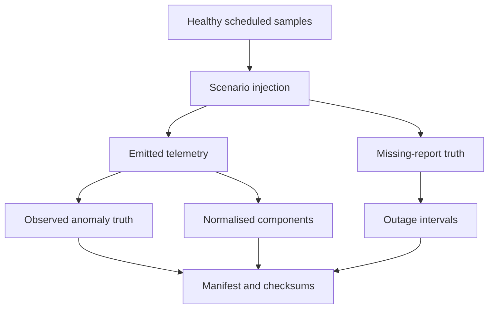

# FleetGuard session — Implement the twelve-scenario catalogue

## Outcome and timebox

This is the agreed extended implementation session: bring the generator to all
twelve scenarios, including both controller outage modes. Allow approximately
60–90 minutes to install, understand and verify the changes. Dataset cohort
construction and one-minute feature engineering come next.

The update is based on the battery-enabled schema-3.1 repository you confirmed
as green and pushed to GitHub. It upgrades the contract to 3.2 and package to
0.2.0. The download is a changed-files package, not a replacement for the whole
repository. Your visual assets are outside this patch.

## 1. Apply the prepared files — 10 minutes

Extract the ZIP. Inside `FleetGuard-anomaly-session`, open `project`. Copy its
contents into `C:\Users\khhal\fleetguard-ai`, merging folders and replacing the
included files. Do not put `project` itself inside your repository.

From your repository root in Windows CMD:

```cmd
.venv\Scripts\activate
python -m pip install -e ".[dev]"
python -m ruff check .
python -m pytest -v
```

The prepared update passed Ruff and 122 tests under Python 3.12. Your Windows
Python 3.14 environment still needs these local checks. No PowerShell commands
are needed. Reinstallation updates the generator version in manifests.

## 2. Understand the contract — 10 minutes

Read `src\fleetguard\contracts\models.py`, starting at `AnomalyType`, then
`SignalQuality`, `QualityTelemetry`, `TelemetryEvent`, `MissingReportTruth`
and `OutageTruth`.

Three ideas matter:

1. **Missing is different from zero.** A failed generator's speed is null with
   quality; a locked axle reports a valid zero speed while the wagon moves.
2. **Demand is different from response.** `brake_demand` comes from the healthy
   operating plan. BPP and the two BCP signals show the injected response.
3. **No power means no event.** A controller cannot transmit a fresh zero-voltage
   row while powered down. Missing-report truth records what the simulator
   scheduled but did not emit.

There is still one BCP per bogie, two per wagon. Schema 3.2 also reports
`available_axle_generators`: four healthy, three in the generator-failure demo.

The quality mixin enforces null/quality consistency. New injectors reconstruct
Pydantic models through `_copy`, which validates changes; Pydantic's ordinary
`model_copy(update=...)` does not validate the update by itself.

## 3. Follow the injection path — 15–20 minutes

| File | Responsibility |
|---|---|
| `generator/anomalies.py` | Existing three injectors, shared scenario configuration and entry point |
| `generator/extended_anomalies.py` | Nine additional signatures, scenario checks, per-wagon state and outage handling |
| `generator/profiles.py` | Builds CLI demonstrations using eligible points in the healthy journey |
| `generator/healthy.py` | Adds apply/release demand from the existing operating state |
| `generator/fleet.py` | Carries observed events, observed truth, missing truth, outages and scenarios together |
| `generator/normalise.py` | Preserves quality in component rows derived from emitted telemetry |
| `generator/output.py` | Writes the datasets, scenario settings and manifest counts/hashes |
| `generator/cli.py` | Makes each profile available through the command line |

The call path is:
`CLI → healthy fleet → selected scenario → fleet injection → output writer`.

Inside `extended_anomalies.py`, `_axle_fault` handles generator failure, slide,
locked axle and suspected flat; `_pressure_fault` handles unavailable pressure;
`_brake_fault` compares demand with response; `_power_fault` handles battery
state and controller silence/recovery. `_State` retains the previous demand,
voltage, timing and reboot state for each affected wagon.

`inject_batch` dispatches the correct signature, preserves healthy control
wagons and validates the emitted models. `_outage_intervals` groups suppressed
report slots. It never creates component observations for a missing event.

The CLI demos target wagon 1. Wagon 2 is a healthy control. One scenario per
wagon per batch is enforced to preserve unambiguous single-label truth. To put
several scenarios in one Python-generated batch, assign them to different
wagons and inject them together.

## 4. Read the tests as behaviour examples — 10 minutes

Read `tests\generator\test_extended_anomalies.py` by test name first.

- Target and control checks establish what changes and what stays healthy.
- Null/quality checks distinguish sensor failure from a real stopped axle.
- Brake tests require the appropriate demand and prior application context.
- Controller tests check sag, silence, return, uptime and reset counts.
- Battery tests check discharge, cutoff and recharge-driven recovery.
- Output tests prove gaps do not acquire fabricated component rows.
- 1-, 10- and 60-second tests verify a configured two-minute blackout by elapsed
  time rather than a fixed number of rows.

`tests\generator\test_cli.py` also runs every new CLI profile end to end.
The original 80 tests remain part of the 122-test suite.

## 5. Generate and inspect the smoke runs — 10–15 minutes

From the repository root:

```cmd
scripts\smoke_all_anomalies.cmd
```

This runs all twelve scenarios, with a separate run for each controller mode,
using two wagons, seed 42 and 60-second sampling. It writes beneath
`data\generated\schema32-smoke`. Output directories must be empty; the command
stops on the first error and does not overwrite existing runs.

Inspect the bounded controller example:

```cmd
type data\generated\schema32-smoke\controller-bounded-demo\manifest.json
type data\generated\schema32-smoke\controller-bounded-demo\outage_truth.jsonl
type data\generated\schema32-smoke\controller-bounded-demo\scenario_metadata.json
```

For that seed and sampling:

| Quantity | Expected |
|---|---:|
| Scheduled reports | 660 |
| Emitted telemetry / observed truth | 650 each |
| Missing reports | 10 |
| Bogie observations | 1,300 |
| Axle observations | 2,600 |
| Wheel observations | 5,200 |
| Recovered outage intervals | 1 |

The persistent controller example has 365 emitted reports and 295 missing
reports. Those 365 include all 330 reports from healthy wagon 2. Bounded mode
has no sag rows, so its anomaly is in missing-report truth rather than in an
observed anomalous event.

For a standard-frequency demonstration, use a fresh output folder:

```cmd
python -m fleetguard.generator --assets 2 --seed 42 --start-time 2026-01-01T06:00:00+00:00 --sampling-interval-seconds 10 --anomaly-profile wheel-slide-demo --output-dir data\generated\slide-10s-01
```

Read `docs\anomaly_catalogue.md` before interpreting the examples. In particular,
the battery smoke profile uses accelerated discharge, the wheel-flat signature
is low-frequency RMS evidence, and injected braking does not re-simulate the
whole train's motion. These are controlled synthetic signatures.

## Output relationship



Truth and scenario files are evaluation-only, never model features. The manifest
is a description and integrity record, not the validator itself. Tests verify
behaviour; subsequent dataset validation will inspect the full cohort.

## 6. Clean stopping point — 5 minutes

Finish when Ruff and all tests pass, the smoke runs complete, and you can
explain the difference between null sensor data and an absent wagon report.
Then review and commit:

```cmd
git diff --stat
git status
git add .
git commit -m "Implement twelve anomaly scenarios and outage truth"
git push
```

This update adds `/data/generated/` to `.gitignore` for new generated files.
Already tracked historical datasets remain tracked; the update does not remove
them. Review `git status` before staging. The assistant maintains its own session status;
you do not need to create or maintain `docs\development_status.md`.

Next session: design reproducible portfolio cohorts and their validation,
including healthy controls, held-out assets, anomaly prevalence and quality/
outage handling before one-minute feature engineering.
